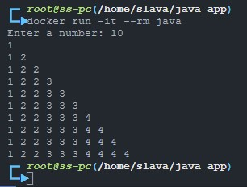

# ФИ: Василакий Вячеслав. Группа: Программирование 6 | 3325 / 3424 | 21.09.2022. Урок №4

### Урок 4. Dockerfile и слои

__Задание:__
<br>
Необходимо создать Dockerfile, основанный на любом образе (вы в праве выбрать самостоятельно).
<br>
В него необходимо поместить приложение, написанное на любом известном вам языке программирования
<br>
(Python, Java, C, С#, C++).
<br>
При запуске контейнера должно запускаться самостоятельно написанное приложение.

### Solution:

`mkdir /home/slava/java_app` <br>
`cd /home/slava/java_app` <br>
`nano Main.java`

```Java
import java.util.Scanner;

public class Main {
    public static void main(String[] args) {
        Scanner in = new Scanner(System.in);
        System.out.print("Enter a number: ");
        int n = in.nextInt();
        for (int i = 1; i <= n; i++) {
            int count = 1;
            for(int j = 1; j <= i; j++) {
                for (int k = 1; k <= j; k++) {
                    if(count <=i) {
                        System.out.print(j);
                    }
                    if(count <i) {
                        System.out.print(" ");
                    }
                    count++;
                }
            }
            if ( i < n) {
                System.out.println();
            }
        }
    }
}
```

`nano Dockerfile` <br>

```Script
FROM openjdk:20
RUN rm -rf /var/lib/apt/lists/*
COPY . /usr/src/myapp
WORKDIR /usr/src/myapp
RUN javac Main.java
CMD ["java", "Main"]
```

`dockerbuild -t java .` <br>
`docker run -it --rm java` <br>
